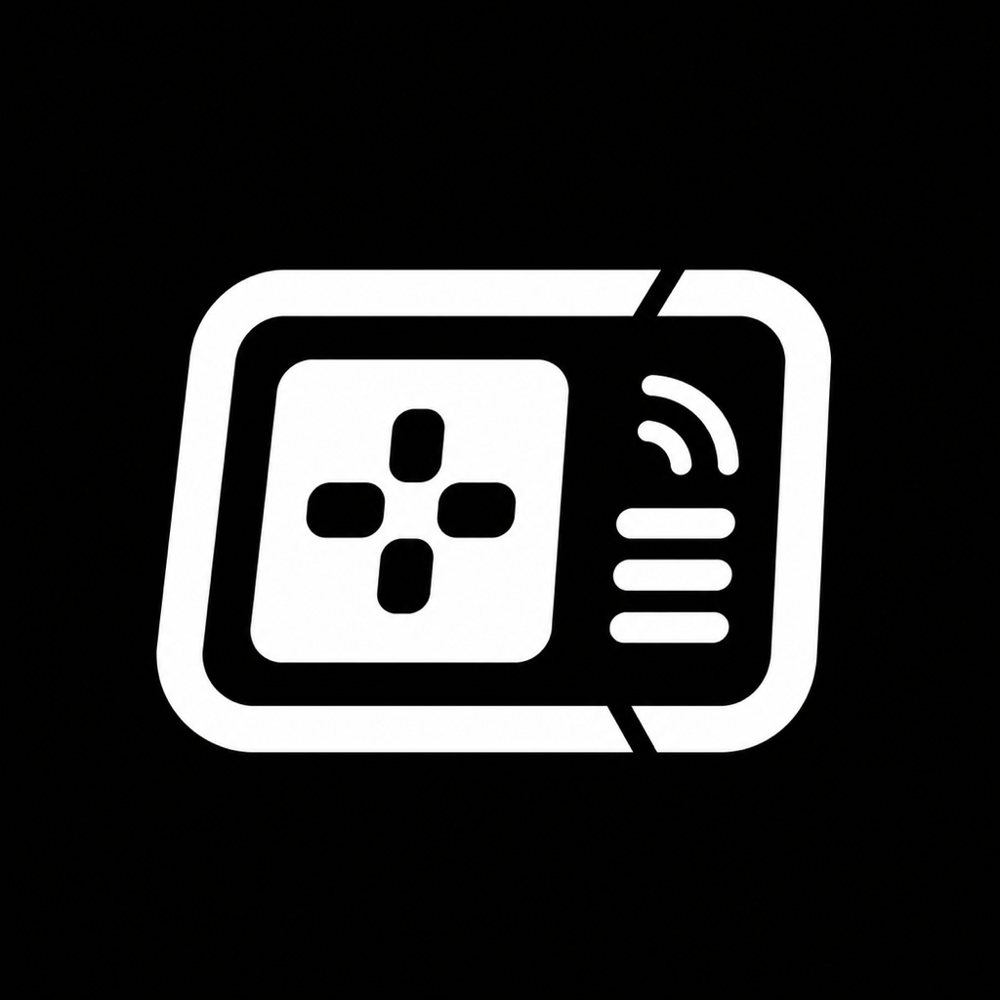
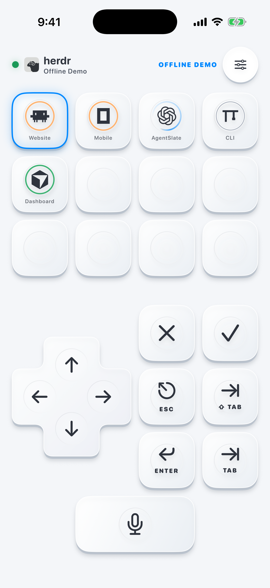
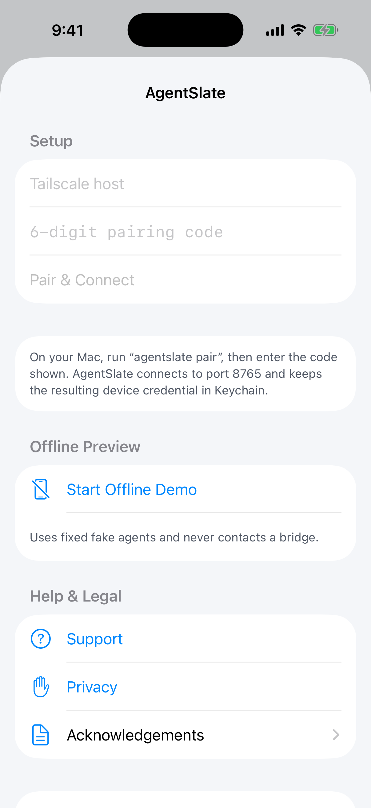

<div align="center">
  
  <h1>AgentSlate</h1>
  <p><strong>Your Herdr agents, within thumb's reach.</strong></p>
  <p>
    An iPhone remote keypad for supervising coding agents running in
    <a href="https://herdr.dev/">Herdr</a> on your Mac.
  </p>
</div>

<p align="center">
  
</p>
<p align="center">
  <em>See every agent at a glance, switch targets, and respond with tactile controls.</em>
</p>

> [!WARNING]
> AgentSlate is beta software. Use it only with agents you can see, and review every permission prompt on the Mac before accepting it from the phone.

## Why AgentSlate

AgentSlate is for the moment when your coding agents are already visible on a monitor, but the keyboard is out of reach. Instead of opening a full remote desktop or terminal client, tap the agent you are watching and send the next key, approval shortcut, or short instruction from your iPhone.

The terminal stays on the Mac. The phone shows agent status and acts as the control surface.

## Highlights

- **Live agent dashboard** — see Herdr sessions, workspaces, and agent states, with blocked agents brought forward.
- **Focused remote controls** — send arrows, Enter, Escape, Tab, Shift+Tab, Space, or short text to the selected agent.
- **Watched-screen actions** — use Accept and Deny shortcuts only when a supported agent is visibly blocked.
- **Private voice input** — Apple's on-device transcription runs on the iPhone; only the resulting text is sent.
- **Direct and private** — connect over Tailscale with a single-use pairing code and a revocable per-device credential.
- **Offline Demo Mode** — explore the complete keypad with fixed sample agents and no bridge connection.

AgentSlate does not stream terminal output, provide a general shell API, use analytics, or require a cloud account. It can still type into a terminal, so treat every key as if you pressed it on the Mac.

## How it works

1. The Rust bridge discovers the Herdr sessions and agents running on your Mac.
2. The iPhone pairs directly with the bridge over your private Tailscale network.
3. Tapping an agent focuses its existing Herdr pane.
4. Key presses, approval shortcuts, and dictated text go only to the selected agent.

## Requirements

To build and explore AgentSlate:

- A Mac running a version of macOS supported by Xcode 26
- Xcode 26 or newer
- An iPhone running iOS 26 or newer, or an iOS 26 simulator
- An Apple ID selected as the Xcode development team when installing on a physical iPhone

For live Herdr control, you also need:

- Herdr 0.7.4 or newer on the Mac
- Tailscale on the Mac and iPhone, signed into the same private network

## Try it

### 1. Start the Mac bridge

```sh
brew install DanielOu1208/agentslate/agentslate
agentslate doctor
brew services start agentslate
```

AgentSlate listens only on loopback or Tailscale addresses. It does not offer a public or general-LAN listening mode.

### 2. Run the iPhone app

Open `ios/AgentSlate.xcodeproj` in Xcode, select an iPhone running iOS 26 or newer, and run the `AgentSlate` scheme. For a physical iPhone, select your Apple Development team so Xcode can sign and install the app.

### 3. Pair the iPhone

With the bridge running, create a pairing code:

```sh
agentslate pair
```

In the iPhone app, enter the Mac's Tailscale IPv4 address and the six-digit code. You can find the address with `tailscale ip -4`; AgentSlate uses port 8765 automatically.

<p align="center">
  
</p>

The code expires after ten minutes, works once, and locks after five failed attempts. A successful pairing creates a separate device credential for that iPhone.

Manage paired phones with:

```sh
agentslate devices list
agentslate devices revoke DEVICE_ID
```

Use **Forget Bridge** in the iPhone app to revoke that phone and remove its local credentials. If the Mac is offline, AgentSlate clears the phone and explains how to revoke the remaining Mac record later.

### Offline preview

After running the app from Xcode, no Herdr or bridge setup is needed to explore the interface. Choose **Start Offline Demo** to use fixed sample agents; buttons respond locally but send nothing to a Mac.

## Development

The repository has three small layers:

| Path | Purpose |
|---|---|
| `src/` | Rust bridge and command-line tool |
| `swift-client/` | Reusable Swift protocol client |
| `ios/` | Native SwiftUI iPhone app |

Build the reusable Swift package:

```sh
swift build --package-path swift-client
swift test --package-path swift-client
```

Build and test the iPhone app with full Xcode:

```sh
xcodebuild test \
  -project ios/AgentSlate.xcodeproj \
  -scheme AgentSlate \
  -destination 'platform=iOS Simulator,name=iPhone 17 Pro Max,OS=latest'
```

Do not send test input to an agent doing valuable work. Live input acceptance should use a disposable Herdr pane.

## Privacy, support, and security

- [Privacy policy](docs/privacy.md)
- [Support](docs/support.md)
- [Security policy](SECURITY.md)
- [Contributing](CONTRIBUTING.md)
- [Third-party notices](THIRD_PARTY_NOTICES.md)

Public support belongs in [GitHub Issues](https://github.com/DanielOu1208/agentslate/issues). Report security problems privately through [GitHub Security Advisories](https://github.com/DanielOu1208/agentslate/security/advisories/new).

## Project documents

- [Product requirements](docs/PRD.md)
- [Protocol v3](docs/PROTOCOL.md)
- [Implementation tracker](docs/IMPLEMENTATION_TRACKER.md)
- [Release checklist and App Store metadata](docs/RELEASE_CHECKLIST.md)

## Non-affiliation

AgentSlate is an independent project. It is not affiliated with, endorsed by, or sponsored by Herdr, Tailscale, Apple, or the makers of the coding agents whose names and marks appear in the app. Those names and marks belong to their respective owners.

This project is also unrelated to the existing [pathupally/AgentSlate repository](https://github.com/pathupally/AgentSlate) and Random Labs' [Slate coding agent](https://www.ycombinator.com/companies/random-labs).

## License

AgentSlate is available under the [MIT License](LICENSE).
